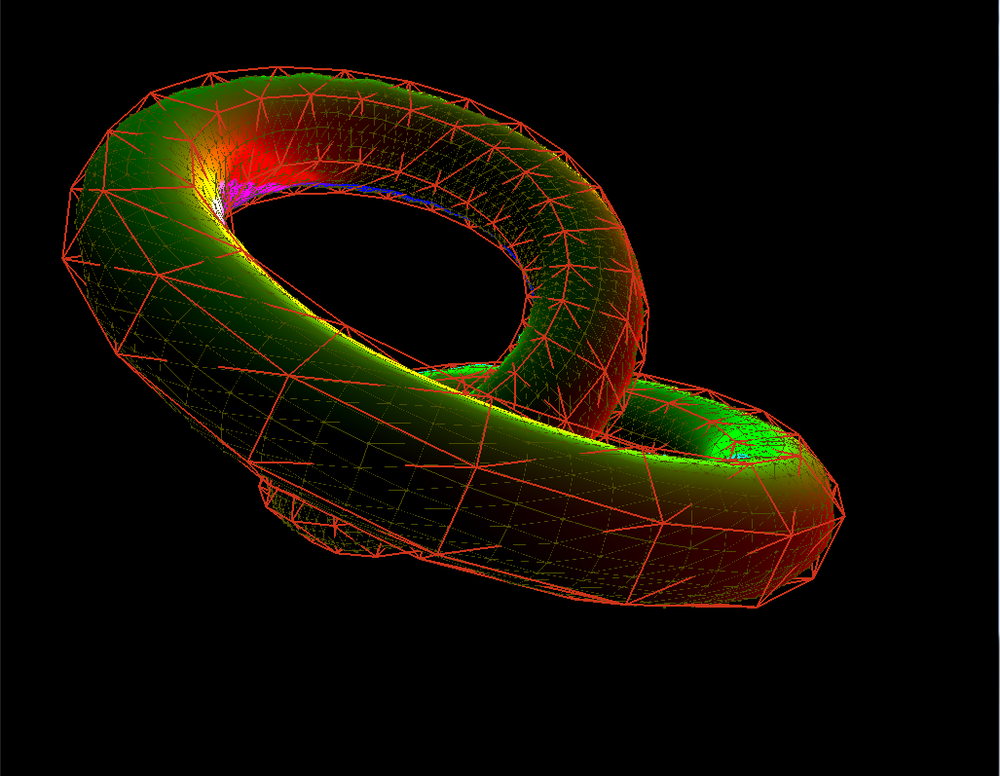
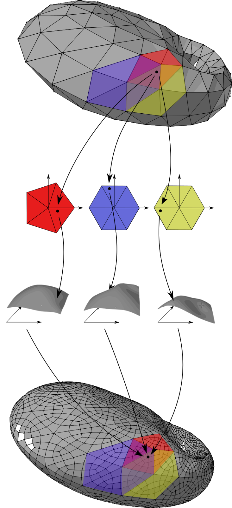
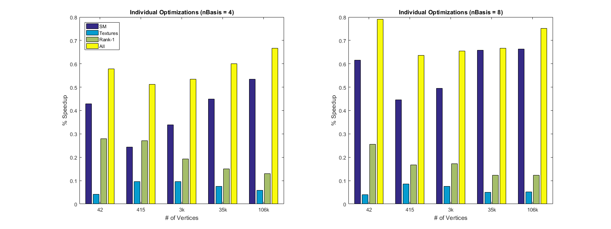
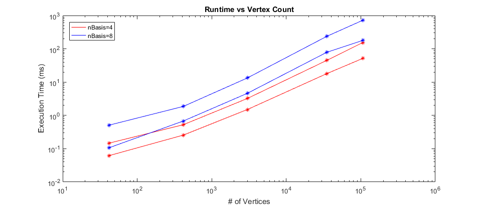
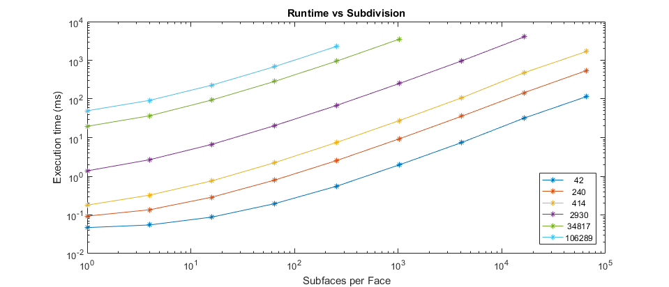

# Parametric Pseudo-Manifolds Using CUDA

## CIS 565 - Fall 2016

## Daniel Krupka, Gabe Naghi

[Parametric Pseudo-Manifolds](http://repository.upenn.edu/cis_reports/877/) (PPMs) are mathematical constructs that
can be used to contruct smooth approximations to data defined on a triangular mesh. Our goal was to implement PPMs
with CUDA, and use them to efficiently generate and manipulate additional detail for 3D models. 

## Overview
PPMs work by associating a smooth, local approximation of the surface to each vertex. Then, when the position
of a point P on the approximation is needed, the three nearest patches are sampled and weighted by their distance to P.

We can also perform this kind of interpolation any kind of per-vertex numerical data, such as vertex normals and
texture UV coordinates. An important consequence is that this separates geometry and topology, i.e. the structure of the approximant mesh is independent of
its vertex positions, normals, etc.

## Implementation

Since the approximations are built from data that is local to each vertex, and all patches are processed identically,
the PPM algorithm is highly parallelizable. The algorithm's outline is as follows:

* Pre-processing:
  * Build two lists of half-edges, one sorted by origin, one sorted by face.
    Additionally, sort each set of half-edges with the same vertex in clockwise order.
  * Generate new topology (but not geometry). We subdivide each face.
  * Precalculate any constant data. We use Bezier surfaces, so this includes evaluating all necessary
    polynomials at all points of interest.
* Main Loop:
  * Get/calculate any changes to vertex data. We use properties of Bernstein polynomials to move vertices
    without needing to fully re-fit Bezier surfaces.
  * For each generated point, evaluate its PPM position/normal/UV.

## Performance Analysis

### First Round - Optimization
Our first round of analysis was to check the effects of various optimizations. The test platform was a Quadro K620,
computing only the generated vertex positions. We focused on the effects of Bezier patch degree and vertex count,
and kept the subdivision level at 10 subfaces per face.
* Shared Memory: Sampling Bezier surfaces requires numerous repeated memory accesses, suggesting
  the use of shared memory to reduce read time.
* Textures: The tessellation pattern is known during preprocessing and never changes, so the local coordinates
  and polynomial values for each patch may be obtained faster if stored and accessed through CUDA's texture
  subsystem.
* Rank-1 Updating: Naively, the coefficients for each patch must be re-fit each time the vertices change. For a
  least-squares fit, this requires a large matrix multiplication. If the shape of each vertex's deformation is
  proportional to a singular vector of this matrix, this can be replaced by a less computationally intensive
  rank-1 update.

Testing shows that, as expected, shared memory use substantially improved computation time with an ~35% speedup. Rank-1 updating
was next most significant, showing on the order of a 25% improvement. Finally, the use of textures did help,
but was nonsubstatial in comparison to other optimizations (~10%). The total improvement was approximately 60%. Also as expected, shared memory
helped more in the degree-8 case, as more redundant reads of Bezier coefficients from main memory were prevented.

There was also a clear correlation between mesh size and execution time, as well as the degree of the Bezier patches.

### Second Round - Stress
We then included all eight vertex attributes (XYZ position, XYZ normal, UV texture), which necessitated a change in SM use, as we originally
read and held all attributes' coefficients in memory at once. Now, only one set was read at a time, and we parallelized over attribute index.
Tests were conducted on a C2075, using degree-4 Bezier patches.

